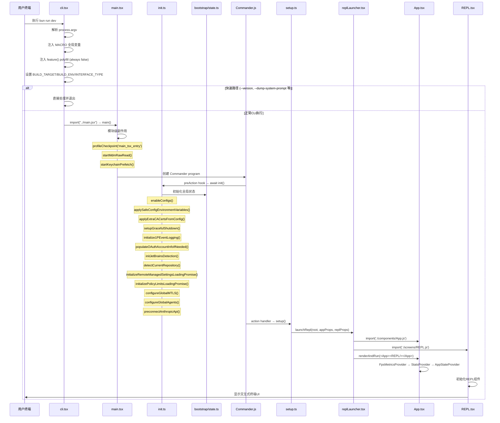
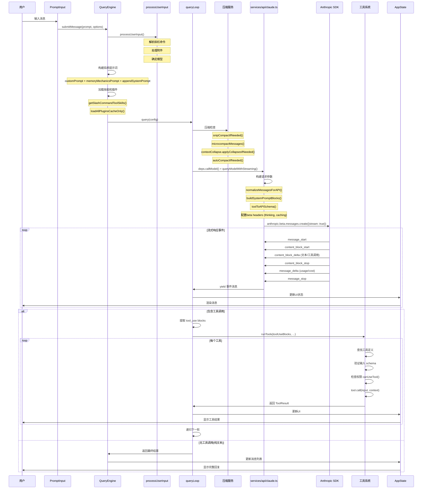
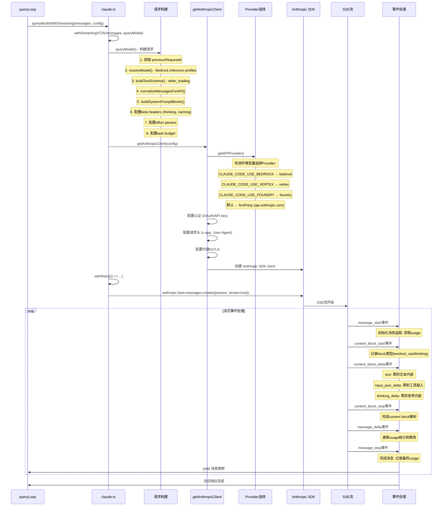
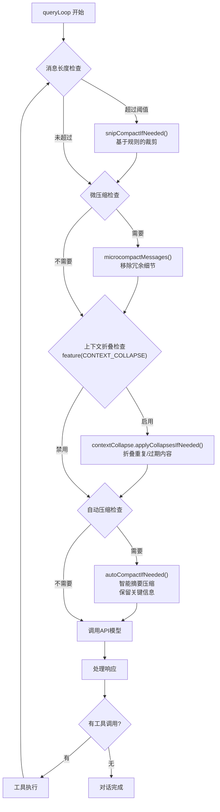
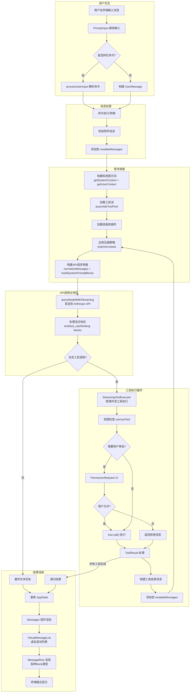

# Claude Code 调用流程图

示例图如下所示

change 141

## 启动流程



## 用户消息查询流程



## 工具执行详细流程

```mermaid
sequenceDiagram
    participant QL as queryLoop
    participant STE as StreamingToolExecutor
    participant FIND as findToolByName
    participant TOOL as Tool.call()
    participant PERM as canUseTool
    participant PERM_UI as PermissionRequest UI
    participant USER as 用户
    participant EXEC as 工具执行逻辑
    participant RESULT as ToolResult

    QL->>STE: 添加工具调用到队列
    STE->>STE: addTool(toolUseBlock)

    STE->>FIND: findToolByName(tools, toolName)
    FIND->>FIND: 在内置工具和MCP工具中查找

    STE->>PERM: canUseTool(tool, input)
    alt 权限自动允许
        PERM->>STE: 允许
    else 需要用户审批
        PERM->>PERM_UI: 显示权限请求
        PERM_UI->>USER: 请求确认
        USER->>PERM_UI: 允许/拒绝
        alt 用户允许
            PERM_UI->>PERM: 允许
        else 用户拒绝
            PERM_UI->->>STE: 拒绝 → 返回拒绝消息
        end
    end

    STE->>TOOL: tool.inputSchema.safeParse(input)
    alt 验证成功
        STE->->>EXEC: tool.call(input, context, canUseTool, message, onProgress)
        loop 进度更新
            EXEC->>STE: onProgress(progressMessage)
            STE->>USER: 显示进度
        end
        EXEC->>RESULT: 返回 {data, newMessages, contextModifier}
        RESULT->>STE: 处理结果
        alt 结果超过 maxResultSizeChars
            STE->>STE: toolResultStorage.persistToDisk()
        else 结果在内存中
            STE->>STE: 直接存储结果
        end
    else 验证失败
        STE->->>QL: 返回验证错误消息
    end

    STE->>QL: 所有工具结果完成

    QL->>QL: 构建工具结果消息
    QL->>QL: 递归进入下一轮对话
```

## API请求构建与流式响应处理流程



## 上下文压缩流程



## 命令处理流程

```mermaid
sequenceDiagram
    participant User as 用户
    participant REPL as REPL.tsx
    participant PROCESS as processUserInput
    participant CMD as 命令系统
    participant QE as QueryEngine

    User->>REPL: 输入 /commit 或其他斜杠命令

    REPL->>PROCESS: processUserInput()

    PROCESS->>PROCESS: 检测斜杠命令前缀 /

    alt 命令存在
        PROCESS->>CMD: 执行命令
        Note over CMD: 命令在 src/commands/ 中定义

        alt 命令返回工具调用
            CMD->>QE: 作为工具结果插入对话
            QE->>User: 继续对话循环
        else 命令直接输出
            CMD->>User: 显示命令输出
        end
    else 命令不存在
        PROCESS->->>QE: 作为普通消息发送
    end
```

## 从用户输入到最终输出的完整流程

