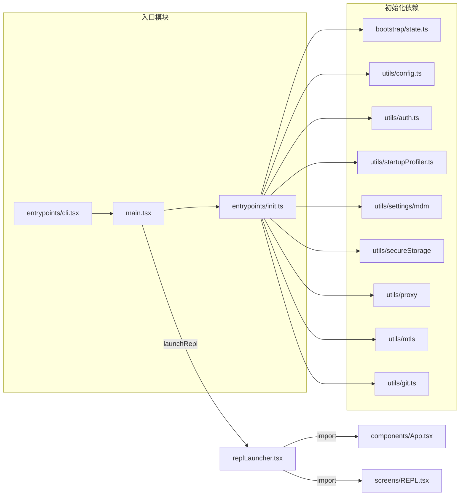
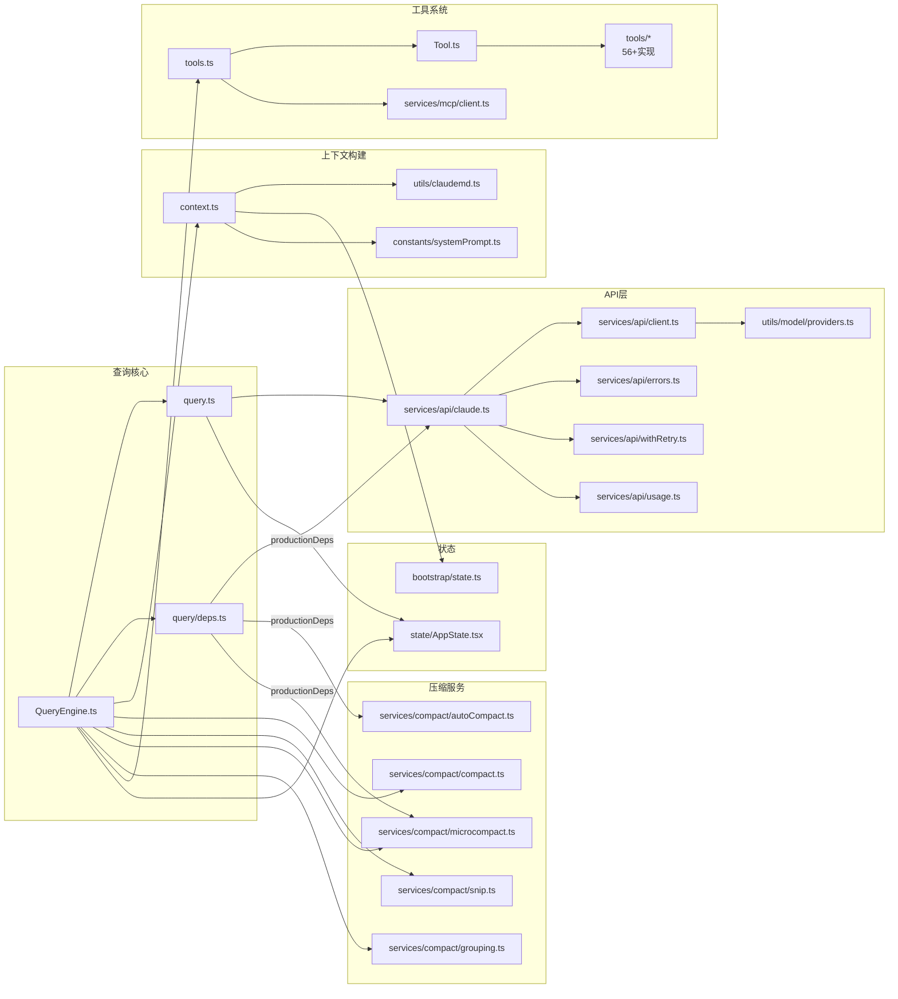
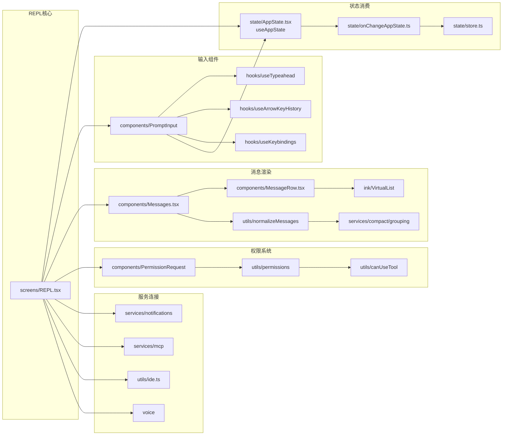
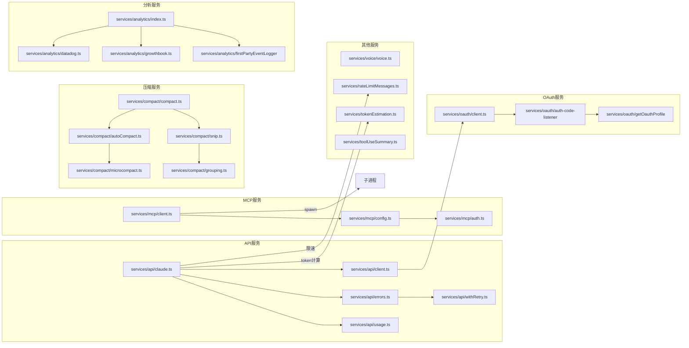
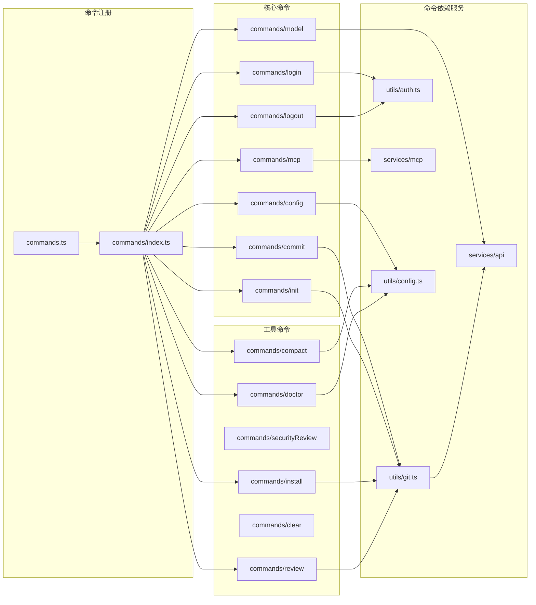
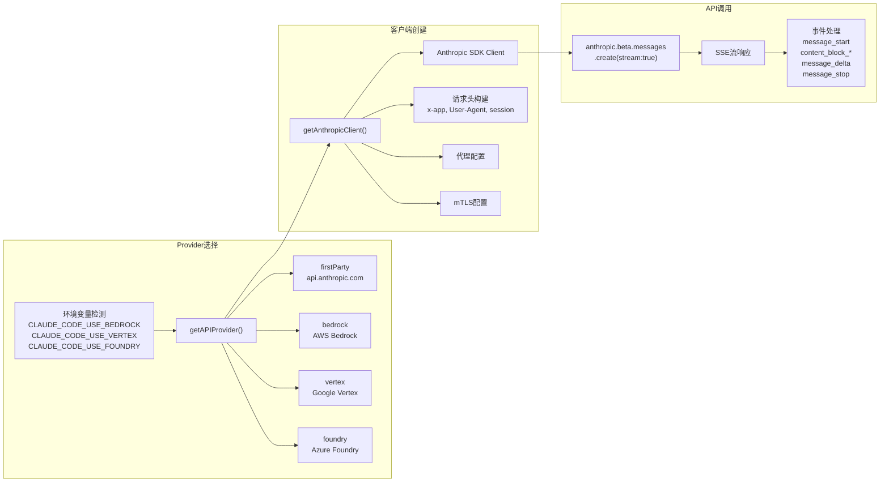
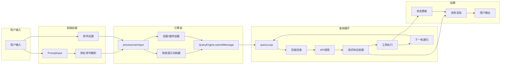

# Claude Code 模块调用关系图

change

## 核心模块依赖关系

```mermaid
graph LR
    subgraph 入口模块
        cli["entrypoints/cli.tsx"]
        init["entrypoints/init.ts"]
        main["main.tsx"]
    end

    subgraph 初始化依赖
        bootstrap["bootstrap/state.ts"]
        config["utils/config.ts"]
        auth["utils/auth.ts"]
        profiler["utils/startupProfiler.ts"]
        mdm["utils/settings/mdm"]
        keychain["utils/secureStorage"]
        proxy["utils/proxy"]
        mtls["utils/mtls"]
        git_utils["utils/git.ts"]
    end

    cli --> main
    main --> init
    init --> bootstrap
    init --> config
    init --> auth
    init --> profiler
    init --> mdm
    init --> keychain
    init --> proxy
    init --> mtls
    init --> git_utils

    main -->|"launchRepl"| replLauncher["replLauncher.tsx"]
    replLauncher -->|"import"| app["components/App.tsx"]
    replLauncher -->|"import"| repl["screens/REPL.tsx"]
```

## 查询引擎依赖关系

```mermaid
graph LR
    subgraph 查询核心
        QE["QueryEngine.ts"]
        query["query.ts"]
        deps["query/deps.ts"]
    end

    subgraph API层
        claude["services/api/claude.ts"]
        client["services/api/client.ts"]
        providers["utils/model/providers.ts"]
        errors["services/api/errors.ts"]
        retry["services/api/withRetry.ts"]
        usage["services/api/usage.ts"]
    end

    subgraph 上下文构建
        context["context.ts"]
        claudemd["utils/claudemd.ts"]
        systemPrompt["constants/systemPrompt.ts"]
    end

    subgraph 压缩服务
        compact["services/compact/compact.ts"]
        autoCompact["services/compact/autoCompact.ts"]
        microcompact["services/compact/microcompact.ts"]
        snip["services/compact/snip.ts"]
        grouping["services/compact/grouping.ts"]
    end

    subgraph 工具系统
        tools["tools.ts"]
        tool_def["Tool.ts"]
        tool_impl["tools/*<br/>56+实现"]
        mcp_tools["services/mcp/client.ts"]
    end

    subgraph 状态
        appState["state/AppState.tsx"]
        bootstrapState["bootstrap/state.ts"]
    end

    QE --> query
    QE --> deps
    query --> claude
    deps -->|"productionDeps"| claude
    deps -->|"productionDeps"| autoCompact
    deps -->|"productionDeps"| microcompact

    claude --> client --> providers
    claude --> errors
    claude --> retry
    claude --> usage

    QE --> context --> claudemd
    context --> bootstrapState
    context --> systemPrompt

    QE --> compact
    QE --> snip
    QE --> microcompact
    QE --> grouping

    QE --> tools --> tool_def --> tool_impl
    tools --> mcp_tools

    QE --> appState
    query --> appState
```

## REPL 与 UI 组件依赖

```mermaid
graph LR
    subgraph REPL核心
        REPL["screens/REPL.tsx"]
    end

    subgraph 状态消费
        appState["state/AppState.tsx<br/>useAppState"]
        onChange["state/onChangeAppState.ts"]
        store["state/store.ts"]
    end

    subgraph 输入组件
        prompt["components/PromptInput"]
        typeahead["hooks/useTypeahead"]
        arrowKey["hooks/useArrowKeyHistory"]
        keybindings["hooks/useKeybindings"]
    end

    subgraph 消息渲染
        messages["components/Messages.tsx"]
        msgRow["components/MessageRow.tsx"]
        vlist["ink/VirtualList"]
        normalize["utils/normalizeMessages"]
        grouping["services/compact/grouping"]
    end

    subgraph 权限系统
        permReq["components/PermissionRequest"]
        permCtx["utils/permissions"]
        canUse["utils/canUseTool"]
    end

    subgraph 服务连接
        notifications["services/notifications"]
        mcp["services/mcp"]
        ide["utils/ide.ts"]
        voice["voice"]
    end

    REPL --> appState --> onChange --> store
    REPL --> prompt --> typeahead
    prompt --> arrowKey
    prompt --> keybindings
    prompt --> appState

    REPL --> messages --> msgRow --> vlist
    messages --> normalize --> grouping

    REPL --> permReq --> permCtx --> canUse
    REPL --> notifications
    REPL --> mcp
    REPL --> ide
    REPL --> voice
```

## 服务层依赖关系

```mermaid
graph LR
    subgraph API服务
        api_core["services/api/claude.ts"]
        api_client["services/api/client.ts"]
        api_errors["services/api/errors.ts"]
        api_retry["services/api/withRetry.ts"]
        api_usage["services/api/usage.ts"]
    end

    subgraph MCP服务
        mcp_client["services/mcp/client.ts"]
        mcp_config["services/mcp/config.ts"]
        mcp_auth["services/mcp/auth.ts"]
    end

    subgraph OAuth服务
        oauth_client["services/oauth/client.ts"]
        oauth_listener["services/oauth/auth-code-listener"]
        oauth_profile["services/oauth/getOauthProfile"]
    end

    subgraph 压缩服务
        compact_core["services/compact/compact.ts"]
        compact_auto["services/compact/autoCompact.ts"]
        compact_micro["services/compact/microcompact.ts"]
        compact_snip["services/compact/snip.ts"]
        compact_group["services/compact/grouping.ts"]
    end

    subgraph 分析服务
        analytics["services/analytics/index.ts"]
        datadog["services/analytics/datadog.ts"]
        growthbook["services/analytics/growthbook.ts"]
        firstParty["services/analytics/firstPartyEventLogger"]
    end

    subgraph 其他服务
        voice["services/voice/voice.ts"]
        rateLimit["services/rateLimitMessages.ts"]
        tokenEst["services/tokenEstimation.ts"]
        toolSummary["services/toolUseSummary.ts"]
    end

    api_core --> api_client --> oauth_client
    api_core --> api_errors --> api_retry
    api_core --> api_usage

    mcp_client --> mcp_config --> mcp_auth
    mcp_client -->|"spawn"| subprocess["子进程"]

    oauth_client --> oauth_listener --> oauth_profile

    compact_core --> compact_auto --> compact_micro
    compact_core --> compact_snip --> compact_group

    analytics --> datadog
    analytics --> growthbook
    analytics --> firstParty

    api_core -->|"token计算"| tokenEst
    api_core -->|"限速"| rateLimit
```

## 命令系统模块依赖

```mermaid
graph LR
    subgraph 命令注册
        commands["commands.ts"]
        cmd_index["commands/index.ts"]
    end

    subgraph 核心命令
        commit["commands/commit"]
        config_cmd["commands/config"]
        mcp_cmd["commands/mcp"]
        model_cmd["commands/model"]
        login["commands/login"]
        logout["commands/logout"]
        init_cmd["commands/init"]
    end

    subgraph 工具命令
        install["commands/install"]
        review["commands/review"]
        security["commands/securityReview"]
        compact_cmd["commands/compact"]
        clear["commands/clear"]
        doctor["commands/doctor"]
    end

    subgraph 命令依赖服务
        git["utils/git.ts"]
        auth_svc["utils/auth.ts"]
        mcp_svc["services/mcp"]
        config_svc["utils/config.ts"]
        api_svc["services/api"]
    end

    commands --> cmd_index --> commit --> git
    cmd_index --> config_cmd --> config_svc
    cmd_index --> mcp_cmd --> mcp_svc
    cmd_index --> model_cmd --> api_svc
    cmd_index --> login --> auth_svc
    cmd_index --> logout --> auth_svc
    cmd_index --> init_cmd --> git
    cmd_index --> install --> git
    cmd_index --> review --> git --> api_svc
    cmd_index --> compact_cmd --> config_svc
    cmd_index --> doctor --> config_svc
```

## Provider选择与API通信链路

```mermaid
graph LR
    subgraph Provider选择
        env_check["环境变量检测<br/>CLAUDE_CODE_USE_BEDROCK<br/>CLAUDE_CODE_USE_VERTEX<br/>CLAUDE_CODE_USE_FOUNDRY"]
        provider["getAPIProvider()"]
        first_party["firstParty<br/>api.anthropic.com"]
        bedrock["bedrock<br/>AWS Bedrock"]
        vertex["vertex<br/>Google Vertex"]
        foundry["foundry<br/>Azure Foundry"]
    end

    subgraph 客户端创建
        get_client["getAnthropicClient()"]
        sdk["Anthropic SDK Client"]
        headers["请求头构建<br/>x-app, User-Agent, session"]
        proxy_conf["代理配置"]
        mtls_conf["mTLS配置"]
    end

    subgraph API调用
        create_msg["anthropic.beta.messages<br/>.create(stream:true)"]
        stream["SSE流响应"]
        process_events["事件处理<br/>message_start<br/>content_block_*<br/>message_delta<br/>message_stop"]
    end

    env_check --> provider
    provider --> first_party
    provider --> bedrock
    provider --> vertex
    provider --> foundry

    provider --> get_client --> sdk --> create_msg --> stream --> process_events
    get_client --> headers
    get_client --> proxy_conf
    get_client --> mtls_conf
```

## 模块间数据流概览

```mermaid
flowchart LR
    subgraph 用户输入
        USER["用户输入"]
    end

    subgraph 前端处理
        PROMPT_I["PromptInput"]
        SLASH["斜杠命令解析"]
        ATTACH["附件处理"]
    end

    subgraph 引擎层
        PROCESS["processUserInput"]
        SYS_PROMPT["系统提示词构建"]
        SKILL_LOAD["技能/插件加载"]
        QE_RUN["QueryEngine.submitMessage"]
    end

    subgraph 查询循环
        QL_START["queryLoop"]
        COMPACT_CHK["压缩检查"]
        API_CALL["API调用"]
        STREAM_RESP["流式响应处理"]
        TOOL_EXEC["工具执行"]
        NEXT_TURN["下一轮递归"]
    end

    subgraph 结果
        MSG_RENDER["消息渲染"]
        STATE_UPD["状态更新"]
        USER_OUT["用户输出"]
    end

    USER --> PROMPT_I --> SLASH --> PROCESS
    USER --> ATTACH --> PROCESS

    PROCESS --> SYS_PROMPT --> QE_RUN
    PROCESS --> SKILL_LOAD --> QE_RUN

    QE_RUN --> QL_START --> COMPACT_CHK --> API_CALL --> STREAM_RESP --> TOOL_EXEC --> NEXT_TURN --> QL_START
    STREAM_RESP --> MSG_RENDER --> USER_OUT
    TOOL_EXEC --> STATE_UPD
    STATE_UPD --> MSG_RENDER
```