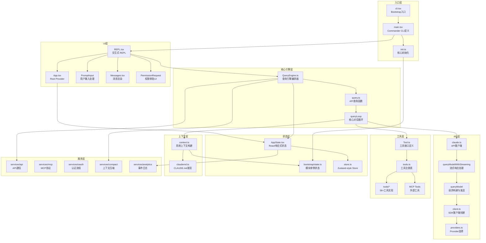

# Claude Code 项目架构总览

## 项目概述

本项目是 Anthropic 官方 Claude Code CLI 工具的反编译/逆向还原版本。核心目标是恢复主要功能，同时裁剪次要能力。使用 Bun 运行时、React/Ink 终端 UI 框架、Commander.js CLI 框架构建。

change here

and here

## 技术栈

| 层级 | 技术 |
|------|------|
| 运行时 | Bun (非 Node.js) |
| 构建 | `bun build --target bun`，单文件打包 |
| 模块系统 | ESM + TSX + react-jsx |
| 包管理 | Bun workspaces, workspace:* |
| CLI框架 | Commander.js |
| UI框架 | React + Ink (终端渲染) |
| 状态管理 | 自定义 Zustand-style store + useSyncExternalStore |
| API通信 | Anthropic SDK streaming endpoint |
| 类型验证 | Zod v4 |
| 编译器 | React Compiler runtime (memoization) |

## 目录结构总览

```
src/
├── entrypoints/          # 入口点 (cli, init, SDK, MCP, sandbox)
├── main.tsx              # Commander CLI 定义 (~239KB)
├── QueryEngine.ts        # 查询引擎核心
├── query.ts              # API查询函数 + queryLoop
├── Task.ts               # 任务管理
├── Tool.ts               # 工具接口定义与构建器
├── tools.ts              # 工具注册表
├── context.ts            # 系统上下文构建
├── cost-tracker.ts       # 费用追踪
├── commands.ts           # 命令模块
├── setup.ts              # 设置逻辑
│
├── bootstrap/            # 启动单例状态 (~58KB state.ts)
├── bridge/               # 桥接通信 (~30 files)
├── buddy/                # 伴侣系统 (精灵动画)
├── cli/                  # CLI处理器、结构化IO、更新机制
├── commands/             # 80+ 命令定义 (commit, config, mcp, login...)
├── components/           # 120+ React UI组件
├── constants/            # 常量、系统提示词、工具限制、OAuth配置
├── context/              # React上下文 (notifications, modal, overlay)
├── coordinator/          # 协调器模式
├── daemon/               #守护进程 (CLI, MCP, sandbox)
├── hooks/                # 80+ React hooks (voice, clipboard, IDE)
├── ink/                  # Ink框架 (forked/internal)
├── jobs/                 # 任务建议、文件建议、权限建议
├── keybindings/          # 键绑定管理
├── memdir/               # 内存/目录管理
├── migrations/           # 版本迁移 (11 files)
├── plugins/              # 插件系统
├── proactive/            # 主动特性
├── query/                # 查询界面 (REPL, Doctor, Resume)
├── remote/               # 远程会话管理
├── schemas/              # 配置与token预算schema
├── screens/              # 屏幕hooks
├── server/               # 服务器后端
├── services/             # 服务层 (api, mcp, oauth, analytics, compact, voice)
├── skills/               # 技能加载与管理
├── ssh/                  # SSH会话管理
├── state/                # 应用状态 (AppState, Store, Selectors)
├── tasks/                # 50+ 工具实现
├── tools/                # 56+ 工具目录 (每个工具独立目录)
├── types/                # TypeScript类型定义
├── utils/                # 200+ 工具模块 (git, file, config, IDE, permissions)
├── vim/                  # Vim模拟 (motions, operators, text objects)
└── voice/                # 语音模式
```

## 核心架构层级图



## Feature Flag 系统

所有 `feature('FLAG_NAME')` 调用来自 `bun:bundle`（构建时API）。在反编译版本中，`feature()` 在 `cli.tsx` 中被 polyfill 为始终返回 `false`。

这意味着以下 Anthropic 内部特性均被禁用：
- COORDINATOR_MODE
- KAIROS / KAIROS_GITHUB_WEBHOOKS
- PROACTIVE
- WORKFLOW_SCRIPTS
- WEB_BROWSER_TOOL
- AGENT_TRIGGERS_REMOTE
- UDS_INBOX
- TERMINAL_PANEL
- CONTEXT_COLLAPSE
- OVERFLOW_TEST_TOOL

## Stubbed/删除模块

| 模块 | 状态 |
|------|------|
| Computer Use (`@ant/*`) | packages/ 中 stub 包 |
| `*-napi` 包 (audio, image, url, modifiers) | packages/ 中 stub |
| Analytics / GrowthBook / Sentry | 空实现 |
| Magic Docs / Voice Mode / LSP Server | 已删除 |
| Plugins / Marketplace | 已删除 |
| MCP OAuth | 已简化 |