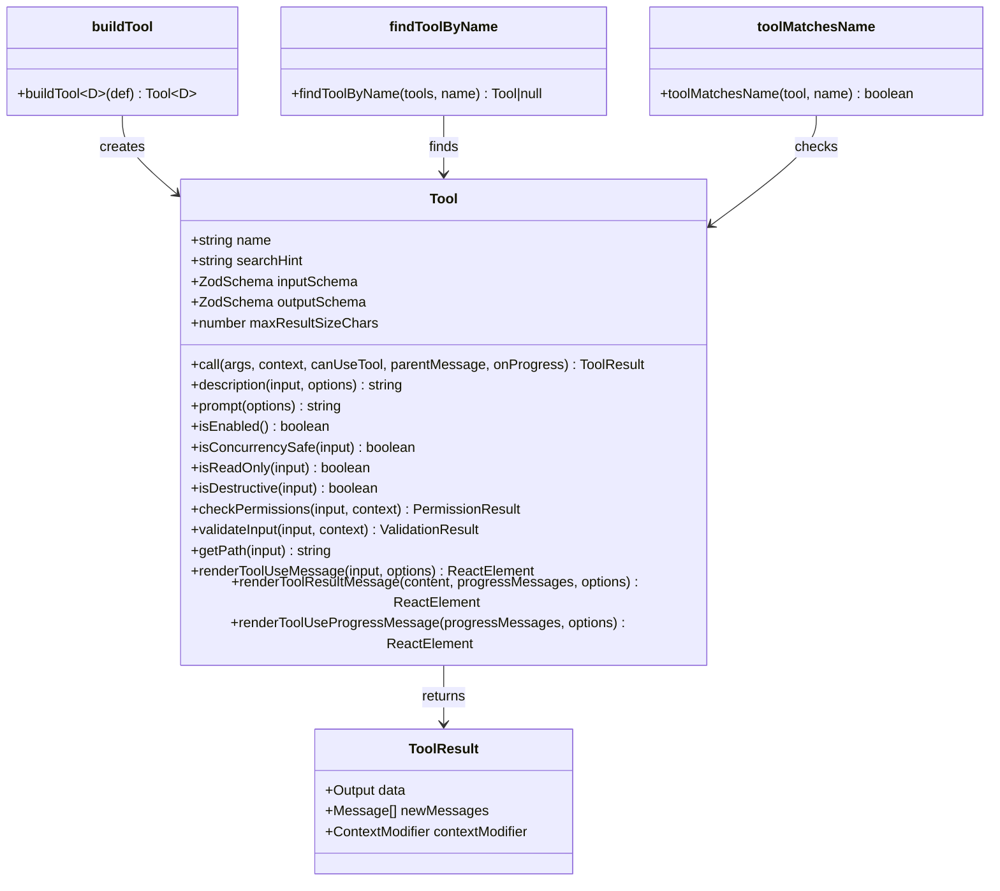
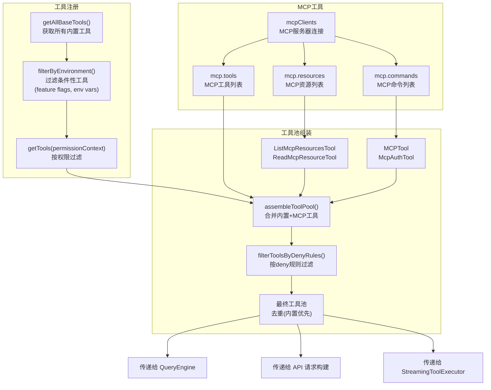
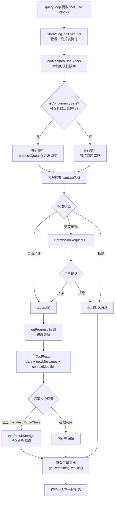
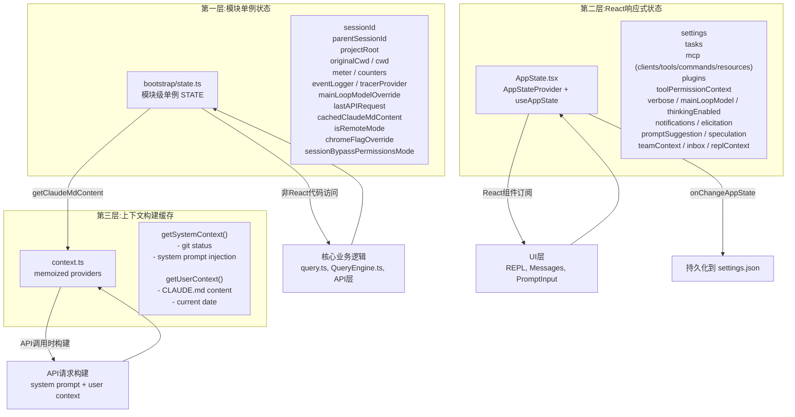
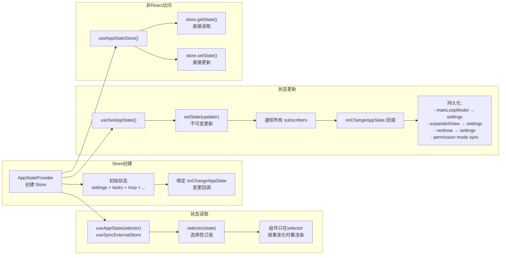
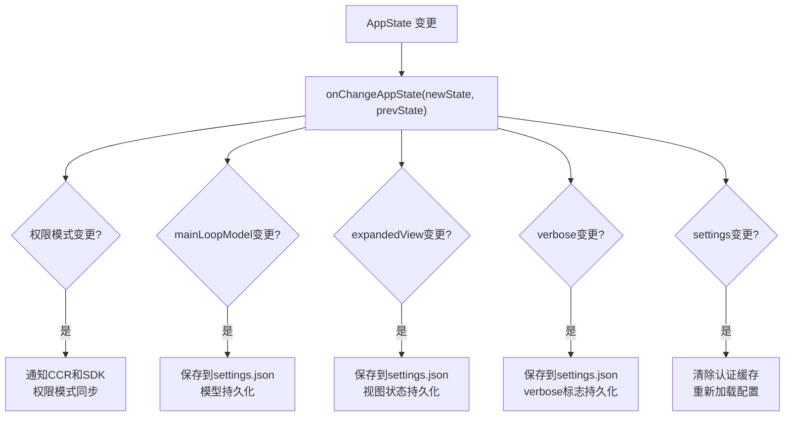
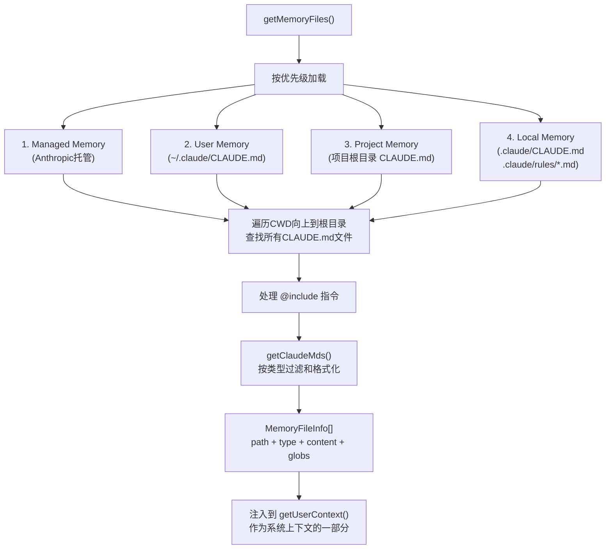
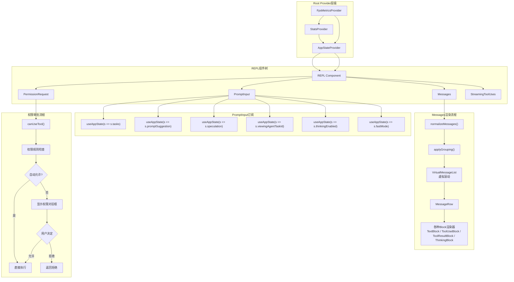
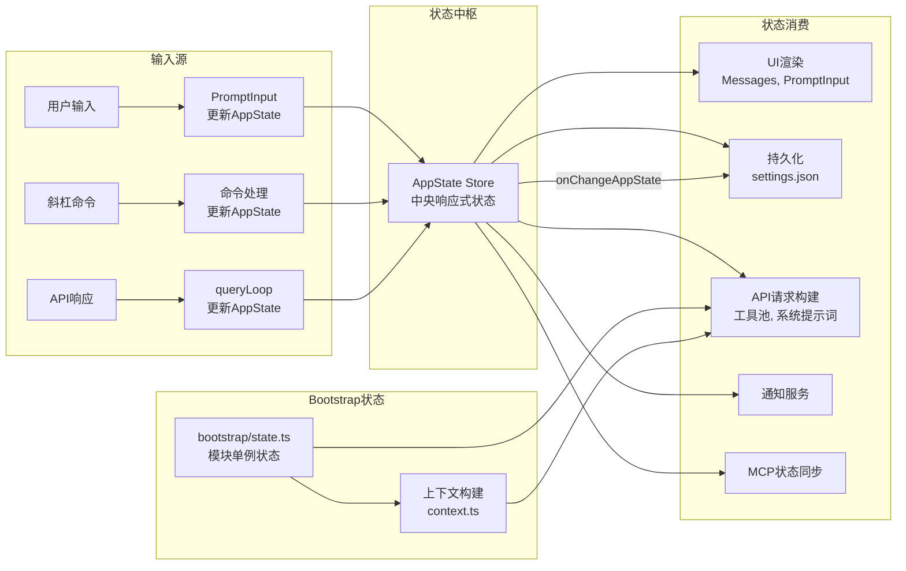

# Claude Code 工具系统与状态管理
change 
## 工具系统架构

### 工具接口定义



### 工具注册与发现流程



### 工具分类与全景

```mermaid
graph TB
    subgraph 文件操作工具
        FR["FileReadTool<br/>读取文件内容"]
        FE["FileEditTool<br/>编辑文件(精确替换)"]
        FW["FileWriteTool<br/>写入/创建文件"]
        GL["GlobTool<br/>按模式搜索文件"]
        GR["GrepTool<br/>搜索文件内容"]
        NB["NotebookEditTool<br/>编辑Jupyter notebook"]
    end

    subgraph 执行工具
        BASH["BashTool<br/>执行shell命令"]
        PS["PowerShellTool<br/>执行PowerShell命令"]
        REPL_T["REPLTool<br/>沙箱REPL执行"]
        MON["MonitorTool<br/>监控命令输出"]
    end

    subgraph 网络工具
        WS["WebSearchTool<br/>网络搜索"]
        WF["WebFetchTool<br/>获取网页内容"]
    end

    subgraph 任务管理工具
        TC["TaskCreateTool<br/>创建任务"]
        TG["TaskGetTool<br/>获取任务详情"]
        TU["TaskUpdateTool<br/>更新任务状态"]
        TL["TaskListTool<br/>列出所有任务"]
        TS["TaskStopTool<br/>停止后台任务"]
        TO["TaskOutputTool<br/>获取任务输出"]
        TW["TodoWriteTool<br/>管理Todo列表"]
    end

    subgraph 交互工具
        AQ["AskUserQuestionTool<br/>向用户提问"]
        EPM["EnterPlanModeTool<br/>进入计划模式"]
        XPM["ExitPlanModeTool<br/>退出计划模式"]
        EWT["EnterWorktreeTool<br/>创建git worktree"]
        XWT["ExitWorktreeTool<br/>退出worktree"]
    end

    subgraph Agent/团队工具
        AGT["AgentTool<br/>生成子Agent"]
        TC2["TeamCreateTool<br/>创建Agent团队"]
        TD2["TeamDeleteTool<br/>删除Agent团队"]
        SM["SendMessageTool<br/>团队内通信"]
    end

    subgraph 调度工具
        CC["CronCreateTool<br/>创建定时任务"]
        CD["CronDeleteTool<br/>删除定时任务"]
        CL["CronListTool<br/>列出定时任务"]
    end

    subgraph 其他工具
        SK["SkillTool<br/>执行技能/斜杠命令"]
        CFG["ConfigTool<br/>配置设置"]
        BF["BriefTool<br/>生成摘要"]
        SL["SleepTool<br/>等待延迟"]
        PN["PushNotificationTool<br/>推送通知"]
        RT["RemoteTriggerTool<br/>远程触发器"]
    end

    subgraph MCP工具
        MRP["ListMcpResourcesTool"]
        MRD["ReadMcpResourceTool"]
        MCP_T["MCPTool<br/>通用MCP工具"]
        MA["McpAuthTool<br/>MCP认证"]
    end

    subgraph 条件性工具(feature-gated)
        VP["VerifyPlanExecutionTool<br/>CLAUDE_CODE_VERIFY_PLAN"]
        OT["OverflowTestTool<br/>OVERFLOW_TEST_TOOL"]
        CI["CtxInspectTool<br/>CONTEXT_COLLAPSE"]
        TC3["TerminalCaptureTool<br/>TERMINAL_PANEL"]
        WB["WebBrowserTool<br/>WEB_BROWSER_TOOL"]
        SUF["SendUserFileTool<br/>KAIROS"]
        WF2["WorkflowTool<br/>WORKFLOW_SCRIPTS"]
        LP["ListPeersTool<br/>UDS_INBOX"]
    end
```

### 工具执行并发管理



## 状态管理架构

### 三层状态体系



### AppState Store 机制



### onChangeAppState 回调处理链



### CLAUDE.md 发现与加载流程



### UI组件与状态连接



### 状态流向总览

